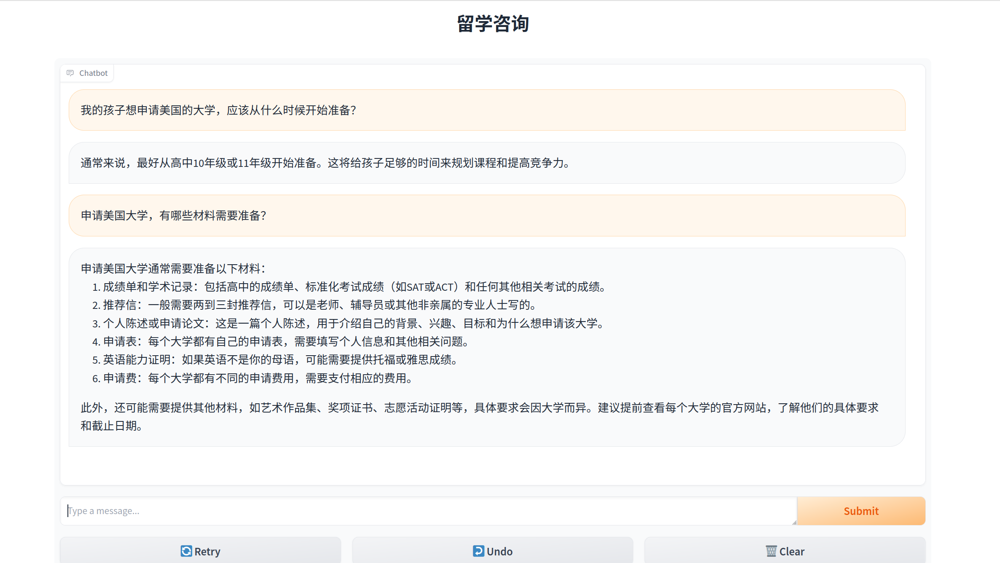

# Chatbot demo

## 这是什么

**留学咨询机器人演示**

你是一家留学服务机构的运营总监，这家机构面向即将出国的高中生、大学生提供培训服务。你需要培训你手下的顾问老师，使得他们能够向学生和家长提供咨询服务。

## 如何运行

1. 创建并进入虚拟环境

    ```bash
    python3 -m venv .*venv
    source .venv/bin/activate
    ```

2. 安装依赖

    ```bash
    pip install -r requirements.txt
    ```

3. 设置环境变量

    * 设置 OpenAI API key: `export OPENAI_API_KEY=xxxxxxxxxxxxxxxx`

4. 运行

    ```bash
    cd src/
    python3 main.py
    ```

    会在浏览器中打开一个 chatbot 窗口。（默认端口号 7860，实际可能不同）


## 运行效果图

